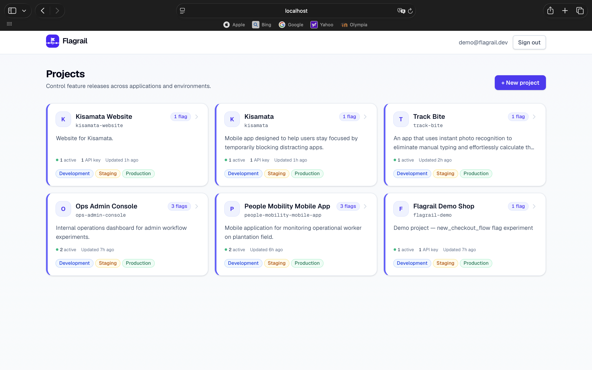
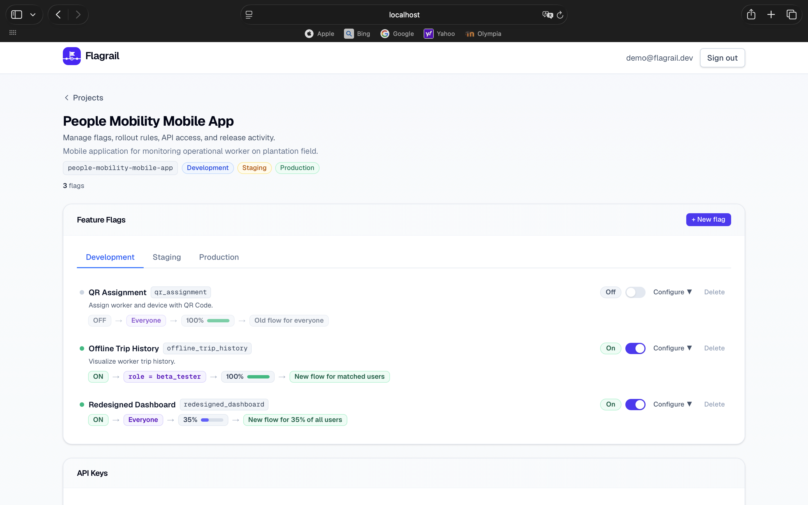
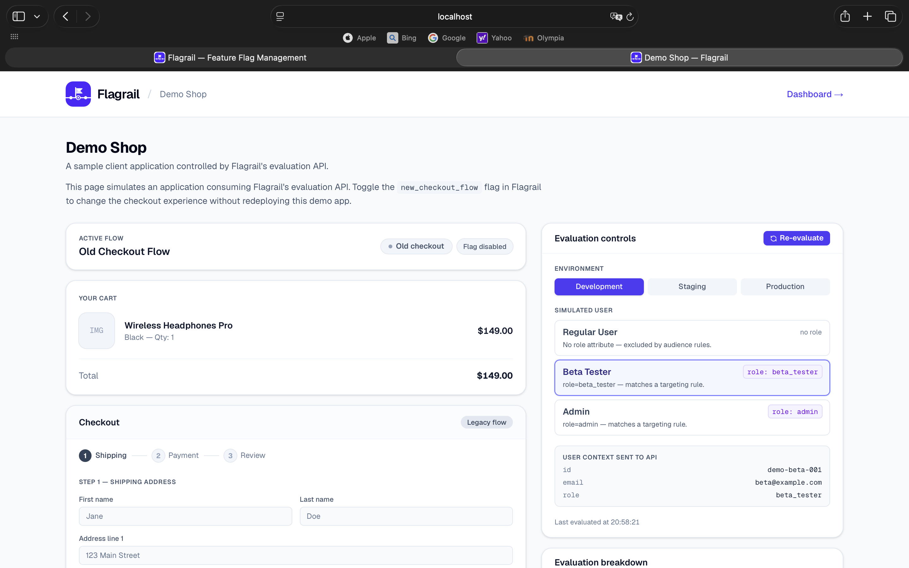
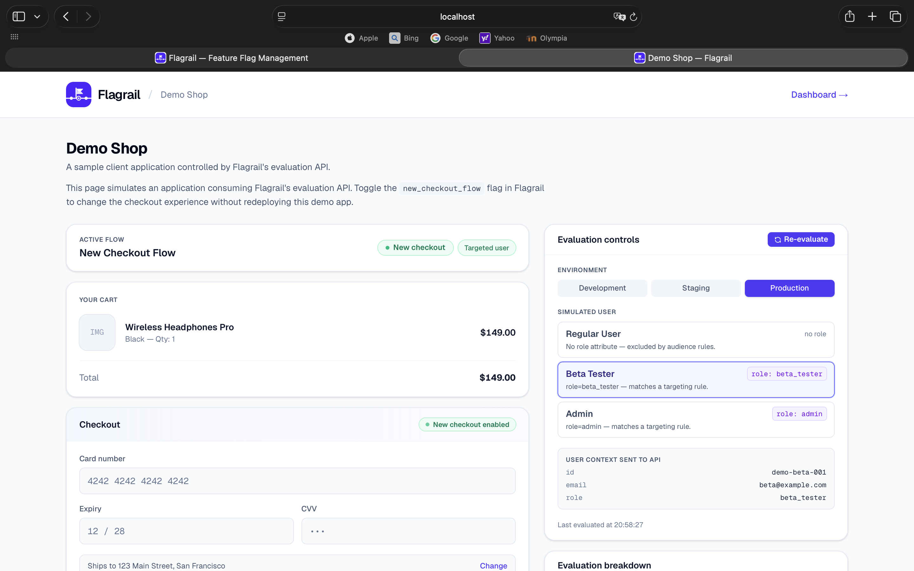

# Flagrail

A **production-quality feature flag management platform** built to demonstrate full-stack engineering: database design, custom JWT auth, deterministic rollout, audit logs, targeting rules, API key management, and a live in-app demo.

> **Why this project?** Feature flags are infrastructure most teams use but few have ever built. Flagrail is a portfolio project that re-implements the core of LaunchDarkly / GrowthBook from scratch — schema, auth, evaluation engine, audit log, public API, and a consumer-facing demo — to demonstrate end-to-end product engineering in a single repository.

---

## Features

- **Multi-tenant projects** with members, environments (Development / Staging / Production), and per-environment flag state
- **Feature flags** with name + key + description; immutable key after creation
- **Targeting rules** (`role = beta_tester`, `email contains @acme.com`, etc.) define the eligible audience
- **Deterministic percentage rollout** — same user always sees the same experience, no flicker
- **Public evaluation API** secured by Bearer API keys (SHA-256 hashed, raw key shown once)
- **Audit log** for every flag toggle, rollout change, rule edit, API key create/revoke, and project creation
- **Custom JWT auth** with `jose` — HTTP-only cookies, no Auth.js dependency
- **Live demo shop** that consumes the evaluation API and swaps its checkout UI based on the result
- **Comprehensive Vitest suite** covering bucketing determinism, audience-then-rollout ordering, and every reason value

---

## What is a feature flag?

Feature flags (also called feature toggles) **decouple deployment from release**. You ship the code to production but keep the feature hidden behind a flag until you're ready:

1. **Dark launch** — deploy with the flag off, verify nothing breaks
2. **Internal testing** — enable for your own `role = admin` accounts only
3. **Beta program** — target `role = beta_tester` users with a targeting rule
4. **Gradual rollout** — 1% → 10% → 50% → 100% by changing a single number
5. **Kill switch** — if something goes wrong, flip it off instantly without a redeploy

---

## Live Demo

> Open [`/demo-shop`](http://localhost:3000/demo-shop) — no login required.

The demo simulates a checkout screen gated behind the `new_checkout_flow` flag. Switch between three users to watch the flag evaluate in real time:

| User | Attributes | Result | Reason |
|---|---|---|---|
| Regular User | _(none)_ | Old Checkout | `excluded_by_targeting_rules` |
| Beta Tester | `role=beta_tester` | New Checkout | `enabled_for_targeted_user` |
| Admin | `role=admin` | New Checkout | `enabled_for_targeted_user` |

The control panel on the right lets you switch environment, swap user, and hit **Re-evaluate**. The evaluation breakdown shows the raw `EvaluationResult` — request inputs, audience match, deterministic bucket (0–99), rollout outcome, and the final reason. The API Response panel mirrors the exact JSON a real client would receive from `POST /api/v1/evaluate`.

---

## Screenshots

**Dashboard — project list**



**Project detail — flags, targeting rules, and rollout**



**Demo Shop — flag enabled (new checkout for a targeted user, Production)**



**Demo Shop — flag disabled (old checkout, Development)**



---

## Tech Stack

| Layer | Technology |
|---|---|
| Framework | Next.js 16 (App Router) |
| Language | TypeScript |
| Database | PostgreSQL 16 |
| ORM | Prisma 7 |
| Auth | Custom JWT via `jose` — HTTP-only cookies, no Auth.js |
| Styles | Tailwind CSS v4 |
| Tests | Vitest — 18 unit tests |
| Local DB | Docker Compose |

---

## Local Setup

### Prerequisites

- Node.js ≥ 18
- Docker Desktop

### Steps

```bash
# 1. Clone and install
git clone https://github.com/fabianradenta/flagrail.git
cd flagrail
npm install

# 2. Environment variables
cp .env.example .env
# Defaults connect to Docker Compose — no edits needed for local dev

# 3. Start PostgreSQL (runs on port 5433 to avoid conflicts with local installs)
docker compose up -d

# 4. Apply migrations
npm run db:migrate

# 5. Seed demo data
npm run db:seed

# 6. Start dev server
npm run dev
```

- Dashboard: [http://localhost:3000](http://localhost:3000)
- Public demo: [http://localhost:3000/demo-shop](http://localhost:3000/demo-shop)

### Reset the database

```bash
docker compose down -v   # wipe the volume
docker compose up -d
npm run db:migrate
npm run db:seed
```

---

## Demo Credentials

After seeding (`npm run db:seed`):

| Email | Password |
|---|---|
| `demo@flagrail.dev` | `password123` |

The seed creates:

- **Project**: `Flagrail Demo Shop` (key: `flagrail-demo`)
- **Environments**: Development, Staging, Production
- **Flag**: `new_checkout_flow` — enabled in Production with targeting rules for `beta_tester` and `admin` roles, rollout 100%
- **Demo API key**: minted on first seed — the raw key is printed once in the terminal (`fr_live_…`). It is never recoverable after that. To rotate, revoke it in the dashboard's API Keys section and re-run `npm run db:seed`.

---

## npm Scripts

```bash
npm run dev          # Start Next.js development server
npm run build        # Production build
npm run lint         # ESLint
npm run db:migrate   # Create and apply a Prisma migration
npm run db:seed      # Seed demo data (idempotent — safe to re-run)
npm run db:studio    # Open Prisma Studio (database GUI)
npm test             # Run Vitest unit tests
```

---

## Environment Variables

| Variable | Description |
|---|---|
| `DATABASE_URL` | PostgreSQL connection string |
| `JWT_SECRET` | Signing key for session tokens. Generate with: `openssl rand -base64 32` |
| `NEXT_PUBLIC_APP_URL` | App base URL (e.g. `http://localhost:3000`) |

---

## Evaluation API

The public evaluation endpoint does not require a user session — authenticate with an **API key** generated from the project dashboard.

### Request

```
POST /api/v1/evaluate
Authorization: Bearer fr_live_<your-api-key>
Content-Type: application/json
```

```json
{
  "projectKey": "flagrail-demo",
  "environment": "production",
  "flagKey": "new_checkout_flow",
  "user": {
    "id": "user_123",
    "role": "beta_tester"
  }
}
```

### Response

```json
{
  "enabled": true,
  "reason": "enabled_for_targeted_user",
  "details": {
    "audienceMatched": true,
    "matchedRules": [
      { "attribute": "role", "operator": "equals", "value": "beta_tester" }
    ],
    "rolloutPercentage": 100,
    "userBucket": 47,
    "isInRollout": true
  }
}
```

### Reason Values

Evaluation flows in two stages: targeting rules define the **eligible audience**, then rollout percentage is applied **within that audience**.

| Reason | Meaning |
|---|---|
| `flag_disabled` | Master switch is off — no user receives the feature |
| `excluded_by_targeting_rules` | Rules are defined but the user matches none — outside the audience |
| `excluded_by_rollout` | User is in the audience but the deterministic bucket is above the rollout threshold |
| `enabled_by_rollout` | Audience matched and bucket fell within a partial rollout (< 100%) |
| `enabled_for_targeted_user` | Rules matched and rollout is 100% — every user in the audience |
| `enabled_for_all_users` | No targeting rules and rollout is 100% — every user |
| `flag_not_found` | Flag key does not exist in the project |
| `environment_not_found` | Environment slug does not exist in the project |

### cURL Example

```bash
curl -X POST http://localhost:3000/api/v1/evaluate \
  -H "Authorization: Bearer fr_live_<your-api-key>" \
  -H "Content-Type: application/json" \
  -d '{
    "projectKey": "flagrail-demo",
    "environment": "production",
    "flagKey": "new_checkout_flow",
    "user": { "id": "user_456", "role": "beta_tester" }
  }'
```

---

## How Deterministic Percentage Rollout Works

Instead of a random coin flip on each request, Flagrail assigns every user a stable **bucket** using a cryptographic hash:

```
bucket = SHA-256(flagKey + ":" + userId) % 100
```

A user is included when `bucket < rolloutPercentage`.

| Property | Why it matters |
|---|---|
| **Stable** | Same user always sees the same experience for a given flag — no flickering |
| **No writes** | Pure computation at evaluation time — no database state needed |
| **Safe ramp-up** | Increasing rollout from 20% → 40% only adds users; never removes already-included ones |
| **Flag-scoped** | A user at bucket 30 for `flag_a` may be at bucket 75 for `flag_b` |

See [`src/lib/evaluate.ts`](src/lib/evaluate.ts) for the implementation and [`src/__tests__/evaluate.test.ts`](src/__tests__/evaluate.test.ts) for the test suite.

---

## Tests

```bash
npm test
```

Vitest unit tests cover:

- `getBucket` — range (0–99), determinism, user distribution, flag-key scoping, regression guard
- `evaluateFlag` — every reason value, audience-then-rollout ordering, operator types (`equals`, `contains`), missing user attributes, returned `details` payload
- Rollout distribution — 50% rollout on 1,000 users falls within ±5% of 500

---

## Key Design Decisions

**Auth** — Custom JWT with `jose`, no Auth.js or Passport. 7-day session tokens in HTTP-only cookies. Edge-compatible, zero auth dependencies.

**API key security** — Raw keys are never stored. On generation the key is hashed with SHA-256; only the hash is persisted. The raw key is shown once on creation and is never recoverable — the same model used by Stripe and GitHub.

**Evaluation architecture** — Split across two layers:
- [`evaluate.ts`](src/lib/evaluate.ts) — pure function, no I/O, fully unit-testable
- [`evaluation-service.ts`](src/lib/evaluation-service.ts) — DB layer that resolves project → environment → flag, then delegates to the pure function

**Audit log** — Every flag toggle, rollout change, API key creation/deletion, and project creation is recorded with timestamp, user, and payload snapshot.

**Audience-then-rollout evaluation** — Targeting rules define the eligible audience first; the rollout percentage is then applied to that audience. This makes "20% of beta testers" expressible as one flag (`role = beta_tester` + 20% rollout) instead of two independent dimensions.

---

## Project Structure

```
src/
├── app/
│   ├── (auth)/                      # Login and register pages (public)
│   ├── (dashboard)/                 # Protected dashboard shell
│   │   ├── dashboard/               # Project list
│   │   └── projects/
│   │       ├── [projectId]/         # Project detail — flags, API keys, audit log
│   │       │   └── flags/new/       # New flag form
│   │       └── new/                 # New project form
│   ├── api/
│   │   ├── auth/                    # POST /register, /login, /logout
│   │   ├── projects/                # Project + flag + targeting rule + API key endpoints
│   │   └── v1/evaluate/             # POST — public evaluation API (Bearer auth)
│   └── demo-shop/                   # Public demo — live flag evaluation, no auth required
├── components/
│   ├── FlagsSection.tsx             # Flag list: toggle, rollout %, targeting rules
│   └── ApiKeysSection.tsx           # API key generation and revocation
├── lib/
│   ├── db.ts                        # Prisma client singleton (PrismaPg adapter)
│   ├── session.ts                   # JWT creation, verification, cookie helpers
│   ├── evaluate.ts                  # Pure evaluation engine — getBucket, evaluateFlag
│   ├── evaluation-service.ts        # DB-backed wrapper around evaluate.ts
│   ├── flags.ts                     # createFlag, updateFlagEnvironment service layer
│   ├── audit.ts                     # createAuditLog helper
│   ├── api-key.ts                   # Key generation — SHA-256 hash, raw key never stored
│   └── utils.ts                     # slugify, slugifyFlagKey, relativeTime
└── proxy.ts                         # Route protection — public paths + JWT verification
prisma/
├── schema.prisma                    # 8 models: User, Project, Environment, FeatureFlag,
│                                    #   FlagEnvironment, TargetingRule, ApiKey, AuditLog
├── seed.ts                          # Demo data — user, project, environments, flag, rules
└── migrations/                      # Prisma migration history
prisma.config.ts                     # Prisma 7 datasource + migration config
docker-compose.yml                   # PostgreSQL 16 on host port 5433
```
